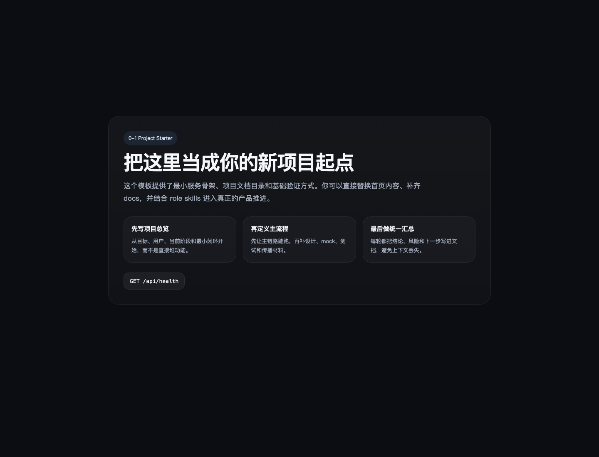
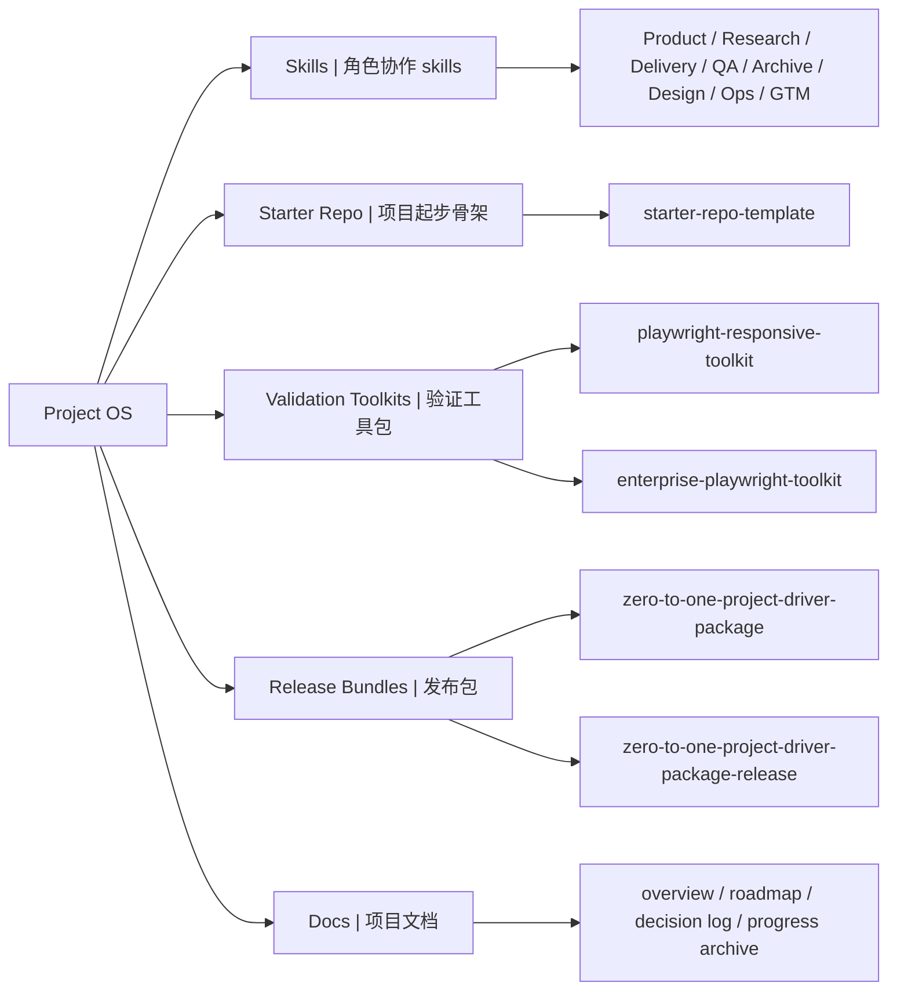

# Project OS

A reusable toolkit for project operating systems, role-based workflows, starter repos, and Playwright validation.  
一个面向项目操作系统、角色协作流程、starter repo 和 Playwright 验证的可复用工具包。

## What This Repo Includes | 仓库包含什么

- Project operating system skills for product, research, delivery, QA, archive, design, ops, and GTM collaboration  
  面向产品、研究、交付、测试、归档、设计、运营和 GTM 协作的项目操作系统 skills
- Starter repo scaffolds for launching new projects faster  
  用于快速启动新项目的 starter repo 骨架
- Playwright toolkits for responsive layout and mobile validation  
  用于响应式布局检查和移动端验证的 Playwright 工具包
- Release-ready bundles for internal sharing and handoff  
  适合内部分享和交接的 release 级打包产物
- Project docs that explain source-of-truth, release boundaries, and packaging decisions  
  说明主维护源、release 边界和打包决策的项目文档

## Who It Is For | 适合谁

- Teams starting new AI or product projects  
  正在启动 AI 或新产品项目的团队
- Builders who want smaller, verifiable project loops  
  希望按更小闭环推进、并持续验证的构建者
- Teams that want documentation, delivery, and validation to stay aligned  
  希望让文档、交付和验证保持一致的团队
- Teams turning one-off project experience into reusable workflows  
  想把一次性项目经验沉淀成可复用工作流的团队

## Quick Start | 快速开始

Start with these entry points:  
建议先从这些入口开始：

1. [Deliverables Index](deliverables/README.md)
2. [Toolkit Map](docs/toolkit-map.md)
3. [Starter Repo Guide](docs/starter-repo-guide.md)
4. [Release Bundle README](deliverables/zero-to-one-project-driver-package-release/README.md)

If you want the fastest path to reuse, begin with the release bundle in `deliverables/zero-to-one-project-driver-package-release/`.  
如果你想最快复用这套体系，建议先从 `deliverables/zero-to-one-project-driver-package-release/` 开始。

## Showcase | 截图预览

Starter repo template homepage preview:  
Starter repo 模板首页预览：



## Visual Map | 结构图



## Repository Map | 仓库结构

```text
project-os/
├── skills/         # source-of-truth role skills
├── deliverables/   # reusable packages, starter repos, validation toolkits
├── docs/           # repository guidance and project memory
├── CHANGELOG.md
└── README.md
```

## Key Packages | 核心包

### `deliverables/zero-to-one-project-driver-package/`

Editable source bundle for the project operating system package.  
可继续编辑和迭代的项目操作系统源码包。

### `deliverables/zero-to-one-project-driver-package-release/`

Stable shareable bundle with versioning, changelog, release notes, and installation docs.  
带版本、changelog、release notes 和安装说明的稳定分享版。

### `deliverables/starter-repo-template/`

Minimal starter repo scaffold for launching new projects.  
用于启动新项目的最小 starter repo 骨架。

### `deliverables/playwright-responsive-toolkit/`

Generic responsive testing toolkit for layout and mobile validation.  
用于布局和移动端验证的通用响应式测试工具包。

### `deliverables/enterprise-playwright-toolkit/`

Advanced Playwright toolkit for more complex validation workflows and enterprise-style test organization.  
适合更复杂验证流程和企业级测试组织方式的高级 Playwright 工具包。

## Usage Examples | 使用示例

### 1. Start a new project | 启动一个新项目

- Use `deliverables/starter-repo-template/` to start with a minimal runnable scaffold.  
  用 `deliverables/starter-repo-template/` 先起一个最小可运行骨架。
- Add role skills from the project driver package to define how the project is planned and delivered.  
  再接入项目推进包里的 role skills，定义项目如何规划和推进。
- Fill the docs templates before the project becomes too large.  
  在项目变大之前先把文档模板补起来。

### 2. Reuse the operating system package | 复用项目操作系统包

- Start with `deliverables/zero-to-one-project-driver-package-release/` if you want the most direct handoff path.  
  如果你想走最直接的交接路径，先从 `deliverables/zero-to-one-project-driver-package-release/` 开始。
- Install the bundled skills and scaffold project docs into your target repository.  
  安装其中的 skills，并把项目文档模板初始化到目标仓库里。
- Use the package as the coordination layer while your actual app code lives elsewhere.  
  让这套包承担协作和推进层，而你的业务代码继续留在独立仓库里。

### 3. Add validation to an existing UI project | 给已有 UI 项目补验证

- Use `deliverables/playwright-responsive-toolkit/` for a generic setup.  
  通用验证优先用 `deliverables/playwright-responsive-toolkit/`。
- Configure `baseURL`, `paths`, and `selectors` for your own pages.  
  按你的页面配置 `baseURL`、`paths` 和 `selectors`。
- Run layout and mobile checks before enabling heavier screenshot regression.  
  先跑布局和移动端验证，再决定要不要开截图回归。

### 4. Use the advanced enterprise toolkit | 使用高级企业版工具包

- Use `deliverables/enterprise-playwright-toolkit/` when you need a more complete testing structure.  
  如果你需要更完整的测试结构，可以用 `deliverables/enterprise-playwright-toolkit/`。
- Reuse its scripts, notifications, and reporting patterns as a stronger baseline.  
  可以复用它的脚本、通知和报告组织方式，作为更强的测试底座。
- Treat it as a reference implementation and adapt it to your own pages and selectors.  
  把它当成参考实现，再按你的页面和选择器做适配。

## Source and Release Boundaries | 主维护源与发布边界

This repository separates maintenance layers on purpose:  
这个仓库有意把维护层次拆开：

1. `skills/` is the source of truth for role skills.  
   `skills/` 是 role skills 的主维护源。
2. `deliverables/zero-to-one-project-driver-package/` is the editable package source.  
   `deliverables/zero-to-one-project-driver-package/` 是可持续编辑的包源码。
3. `deliverables/zero-to-one-project-driver-package-release/` is the stable release bundle.  
   `deliverables/zero-to-one-project-driver-package-release/` 是稳定 release 包。
4. Business-project copies should not be treated as the primary maintenance source.  
   业务项目中的复制件不应当成主维护源。

## Current Status | 当前状态

- Repository status: public initial release  
  仓库状态：公开首发版本
- Repository version: `v0.1.0`  
  仓库版本：`v0.1.0`
- Latest repository notes: [docs/releases/v0.1.0.md](docs/releases/v0.1.0.md)  
  最新仓库发布说明：[docs/releases/v0.1.0.md](docs/releases/v0.1.0.md)

## Documentation | 文档入口

- [Deliverables Index](deliverables/README.md)
- [Project Overview](docs/project-overview.md)
- [Progress Archive](docs/progress-archive.md)
- [Decision Log](docs/decision-log.md)
- [Open Source Readiness](docs/open-source-readiness.md)
- [Usage Examples](docs/usage-examples.md)

## License | 许可证

[MIT](LICENSE)
